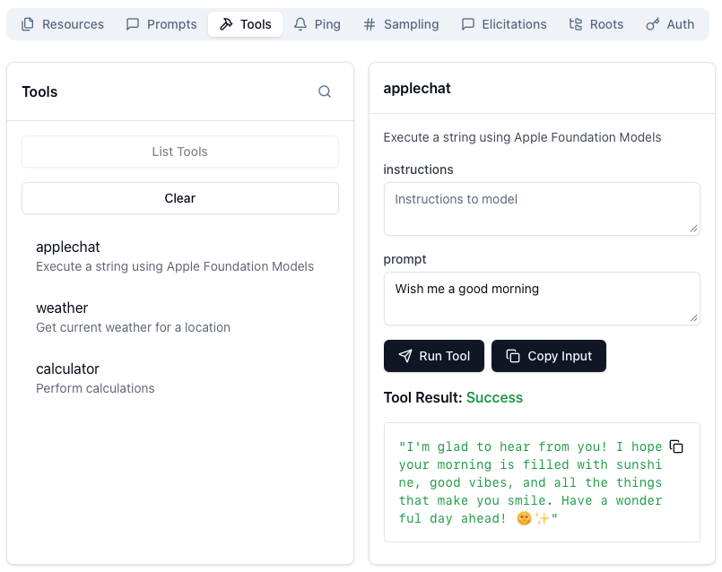

# HelloMCP
A simple MCP server in Swift, running on macOS

## Introduction

For my current use-case — and to better understand the Model Context Protocol (MCP) — I built a small MCP tool that processes a string using the Apple Foundation Models. I used the [official Swift SDK for Model Context Protocol servers and clients](https://github.com/modelcontextprotocol/swift-sdk), and the result is a minimal, working MCP server you can use as a reference.

## Challenges

The documentation of the  [MCP Swift SDK]((https://github.com/modelcontextprotocol/swift-sdk)) still follows an older version of the specification and does not match the current [MCP 2025-06-18 tool schema](https://modelcontextprotocol.io/specification/2025-06-18/server/tools).

For example, the documentation shows a tool defined like this:
```swift
        Tool(
            name: "weather",
            description: "Get current weather for a location",
            inputSchema: .object([
                "properties": .object([
                    "location": .string("City name or coordinates"),
                    "units": .string("Units of measurement, e.g., metric, imperial")
                ])
            ])
        )
```
However:
-	The [MCP Inspector](https://modelcontextprotocol.io/docs/tools/inspector) will not list tools defined in this format.
-	The root cause is that the schema must follow the JSON Schema–shaped structure expected by current MCP servers, including explicit "type" annotations and object-typed field descriptors.

The corrected version looks like this:
```swift
        Tool(
            name: "weather",
            description: "Get current weather for a location",
            inputSchema: .object([
                "type": .string("object"),
                "properties": .object([
                    "location": .object([
                        "description": .string("City name or coordinates"),
                        "type": .string("string"),
                        "units": .string("Units of measurement, e.g., metric, imperial")
                    ])
                    
                ])
            ])
        )
```
Key differences compared to the documentation:
1.	Every schema object must declare its "type" explicitly.
2.	Properties must themselves be JSON-object descriptors, not bare `.string(…)` values.
3.	Descriptions belong inside the dictionary of each property, not as the property value.
4.	Adding "required" improves compatibility with the Inspector and many clients.

Once defined this way, the MCP Inspector correctly discovers and validates the tool.

---

That’s it — a tiny but complete MCP server in Swift, and a working reference for defining tools using the up-to-date schema.


Have fun building your own MCP tools! If you run into issues, feel free to ask — I’m happy to help.
